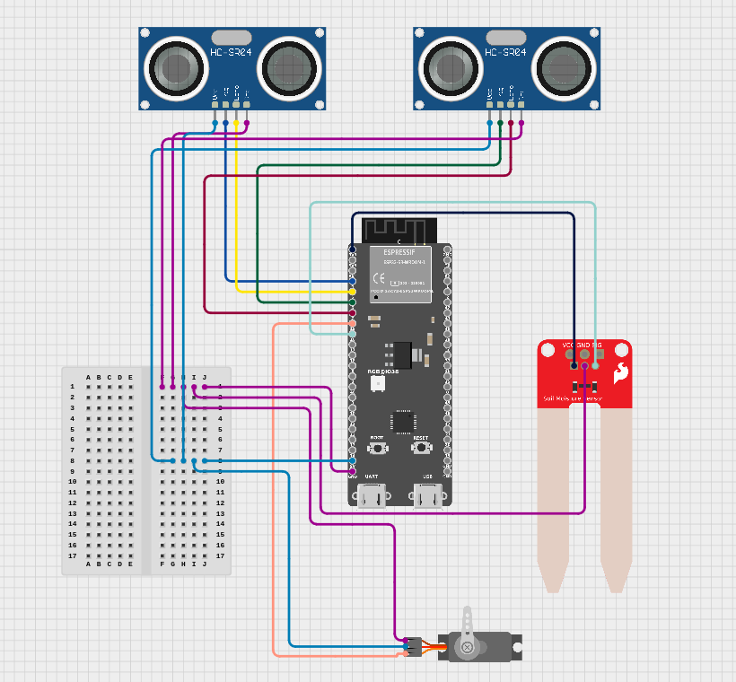

# Smart Dustbin ESP32-S3

This project is a smart dustbin prototype built with an ESP32-S3 board, an HC-SR04 ultrasonic sensor, a soil moisture sensor, and a servo motor. The goal is to detect an approaching object, read moisture information, and open or close the dustbin lid with a servo.

## Wiring Diagram

## Project Overview

The codebase is organized as a PlatformIO Arduino project for the Adafruit Feather ESP32-S3. The current source structure separates the board, motor, sensor, and configuration logic so the hardware behavior can be expanded in small pieces.

## Hardware

- ESP32-S3 development board
- HC-SR04 ultrasonic sensor
- Soil moisture sensor
- Servo motor for the lid
- Breadboard and jumper wires

## Pin Mapping

The current configuration in `src/utils/config.h` uses these pins:

- Ultrasonic trigger: GPIO 16
- Ultrasonic echo: GPIO 17
- Soil moisture sensor: GPIO 15
- Servo signal: GPIO 18

## Build Setup

1. Open the project in PlatformIO.
2. Make sure the selected environment is `adafruit_feather_esp32s3`.
3. Install the Servo library dependency from `platformio.ini`.
4. Build and upload the project to the ESP32-S3 board.

## Current Status

The project is still in progress. The servo module is initialized in `src/main.cpp`, and the sensor and motor modules are being organized for the full smart dustbin workflow.

## File Structure

- `src/main.cpp` - main sketch entry point
- `src/motor/` - servo control code
- `src/sensors/` - ultrasonic and soil moisture sensor code
- `src/utils/config.h` - hardware pin definitions
- `circuit/circuit.png` - wiring diagram
